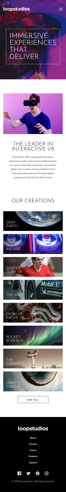

# Loopstudios landing page solution

It is developed with HTML, CSS and Javascript and build with eleventy.

## Table of contents

- [Overview](#overview)
  - [The challenge](#the-challenge)
  - [Screenshot](#screenshot)
  - [Links](#links)
- [My process](#my-process)
  - [Built with](#built-with)
  - [What I learned](#what-i-learned)
- [Author](#author)

## Overview

### The challenge

Users should be able to:

- View the optimal layout for the site depending on their device's screen size
- See hover states for all interactive elements on the page

### Screenshot

Mobile

Desktop

### Links

- [Solution URL](https://github.com/jcnevess/loopstudios-landing)
- [Live Site URL](https://jcnevess.github.io/loopstudios-landing/)

## My process

### Built with

- Semantic HTML5 markup
- CSS custom properties
- Flexbox
- CSS Grid
- Mobile-first workflow

### What I learned

It was a good practice for positioning and Css Grid.

## Author

- Website - [Júlio Neves](https://jcnevess.github.io/)
